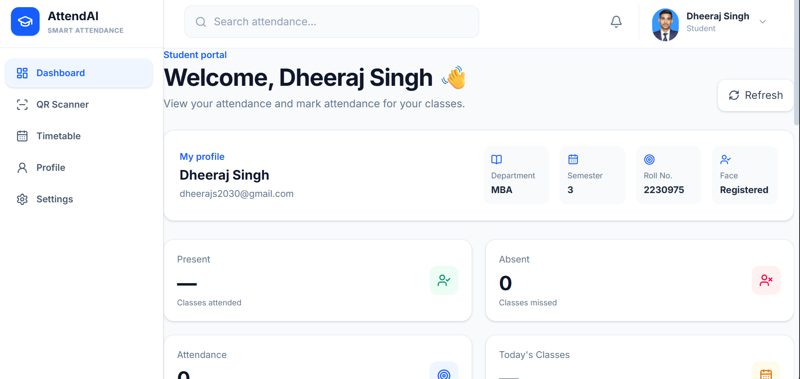
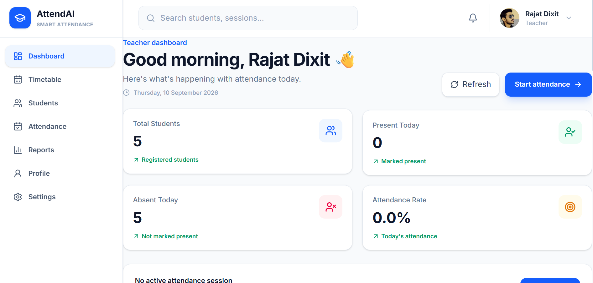
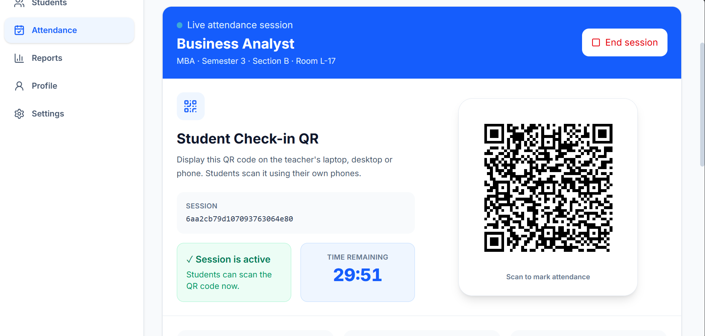
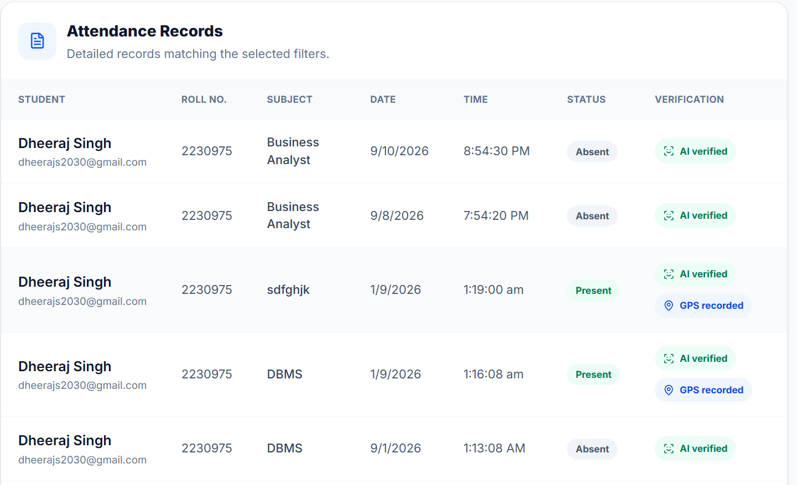
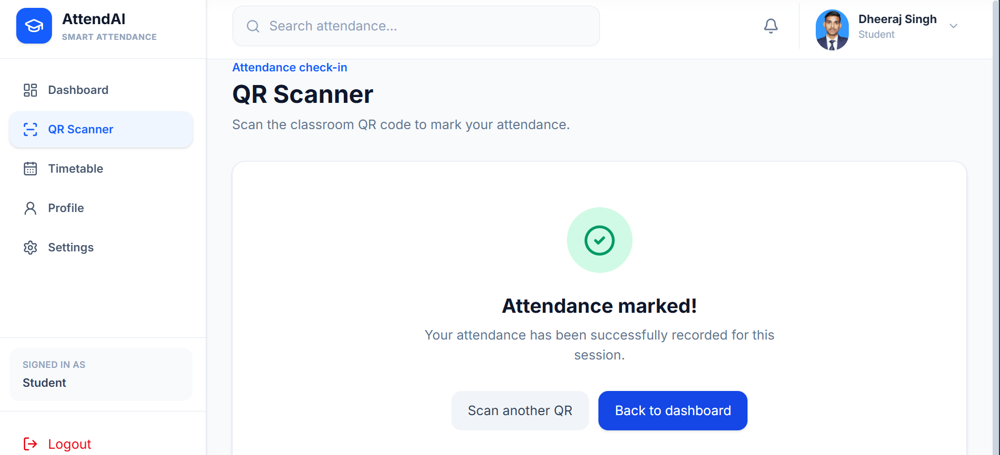
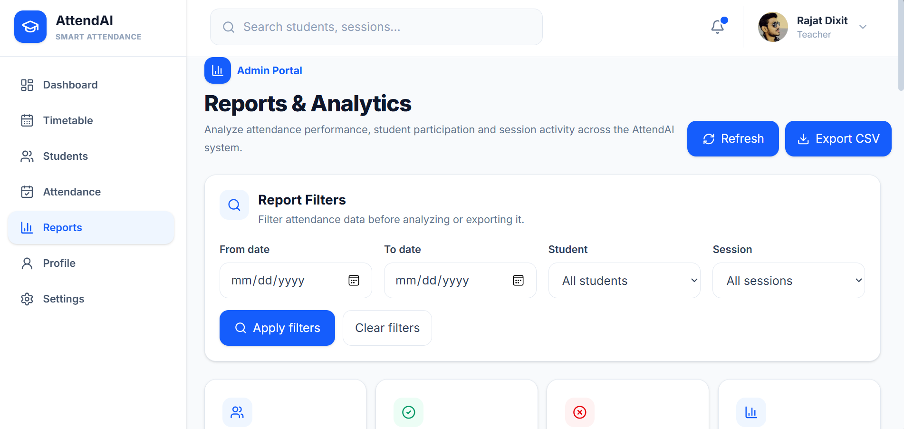

# AttendAI

> **AI-Powered Attendance Management System**

AttendAI is a smart attendance management system designed to make classroom attendance **secure, accurate, and efficient**.

The system combines **QR-based attendance sessions, face verification, GPS verification, academic eligibility checks, and role-based dashboards** for Students, Teachers, and Administrators.

---

## 🚀 Features

### 👨‍🎓 Student

- Secure registration and login
- Student profile management
- Department, semester, section, and roll number management
- View eligible active attendance sessions
- QR-based attendance
- Face verification
- GPS-based location verification
- Attendance history
- Attendance summary
- Notifications
- Responsive dashboard

### 👨‍🏫 Teacher

- Secure teacher login
- Teacher profile management
- Create attendance sessions
- Configure attendance duration
- Generate QR codes
- Session countdown and automatic expiry
- Classroom location and attendance radius
- Department, semester, and section-based session eligibility
- Attendance monitoring
- Attendance history and reports
- Notifications
- Responsive dashboard

### 🛡️ Administrator

- Secure admin login
- Student management
- Teacher management
- Attendance overview
- Dashboard statistics
- Timetable management
- Teacher account creation
- Teacher credential email workflow

---

## 🔐 Attendance Verification

AttendAI applies multiple verification layers before an attendance record is created:

1. Student authentication
2. Valid attendance session
3. QR/session verification
4. Session expiry validation
5. Department verification
6. Semester verification
7. Section verification
8. GPS location verification
9. Face verification
10. Duplicate attendance prevention

> **If a required verification fails, attendance is not recorded.**

---

## 🏗️ System Architecture

```text
                    ┌─────────────────────────┐
                    │   AttendAI Web App      │
                    └────────────┬────────────┘
                                 │
             ┌───────────────────┼───────────────────┐
             │                   │                   │
             ▼                   ▼                   ▼
        ┌──────────┐       ┌──────────┐       ┌──────────┐
        │ Student  │       │ Teacher  │       │  Admin   │
        │Dashboard │       │Dashboard │       │Dashboard │
        └────┬─────┘       └────┬─────┘       └────┬─────┘
             │                  │                  │
             └──────────────────┼──────────────────┘
                                ▼
                    ┌─────────────────────────┐
                    │   Node.js + Express     │
                    │        Backend          │
                    └────────────┬────────────┘
                                 │
              ┌──────────────────┼──────────────────┐
              │                  │                  │
              ▼                  ▼                  ▼
        ┌──────────┐       ┌──────────┐       ┌──────────┐
        │ MongoDB  │       │ AI Service│       │  Email   │
        │ Database │       │ Flask/Python│     │ Service  │
        └──────────┘       └─────┬────┘       └──────────┘
                                 │
                                 ▼
                       ┌──────────────────┐
                       │ DeepFace + ArcFace│
                       │ Face Recognition │
                       └──────────────────┘
📋 Attendance Workflow

    Student Login
         ↓
  Eligible Active Session
         ↓
  Scan Teacher QR
         ↓
  Validate Session & Expiry
         ↓
Check Department / Semester / Section
         ↓
   Verify GPS Location
         ↓
    Verify Face
         ↓
  Check Duplicate Attendance
         ↓
  Attendance Marked

  🛠️ Tech Stack

| Layer          | Technology                          |
| -------------- | ----------------------------------- |
| Frontend       | React, Vite, HTML5, CSS, JavaScript |
| Backend        | Node.js, Express                    |
| Database       | MongoDB                             |
| AI Service     | Python, Flask, DeepFace, ArcFace    |
| Authentication | JWT, bcrypt                         |
| Attendance     | QR Code, GPS, Face Verification     |
| Email          | SMTP                                |

📁 Project Structure

AttendAI/
│
├── frontend2_final/       # React frontend
│
├── backend/               # Node.js + Express backend
│
├── ai-service/            # Flask face-recognition service
│
├── docs/
│   └── screenshots/       # Project screenshots
│
├── .env.example           # Environment configuration template
├── .gitignore
├── README.md
└── start-project.ps1      # Local development startup script

📸 Screenshots

Explore the AttendAI interface across authentication, student, teacher, attendance, and analytics workflows.

🔐 Authentication


👨‍🎓 Student Dashboard


👨‍🏫 Teacher Dashboard


🟢 Attendance Session


📋 Attendance Record


✅ Attendance Marked


📊 Reports & Analytics

